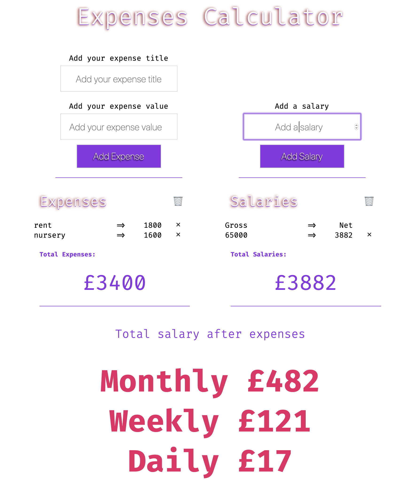

# Household Expenses Calculator

App to check if you (and couple) earn enough money to afford your life style

[Calculate your expenses in this example app](https://byverdu.github.io/household-expenses-calculator/)

## National Insurance

  The National Insurance threshold was £8,424 a year.
  
  If you earn above the threshold, you pay 12% of your earnings between £8,424 and £46,350.

  On anything you earn above £46,350 a year, you pay National Insurance at 2%.

## Taxes

  Income up to £12,500 - 0% income tax. This is your personal tax-free allowance.

  Income between £12,501 and £50,000 - 20% income tax

  Income between £50,001 and £150,000 - 40% income tax

  Income above £150,001 - 45% income tax.

